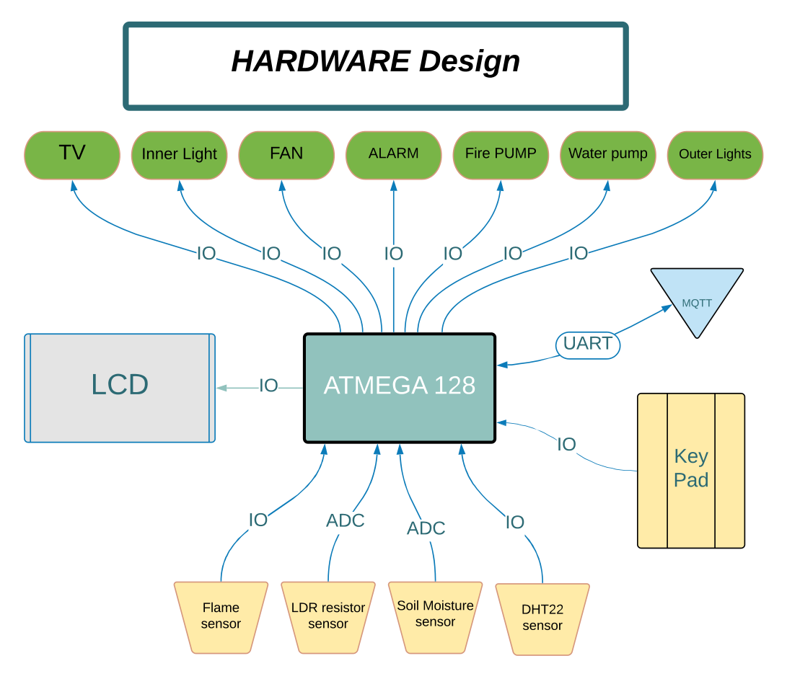
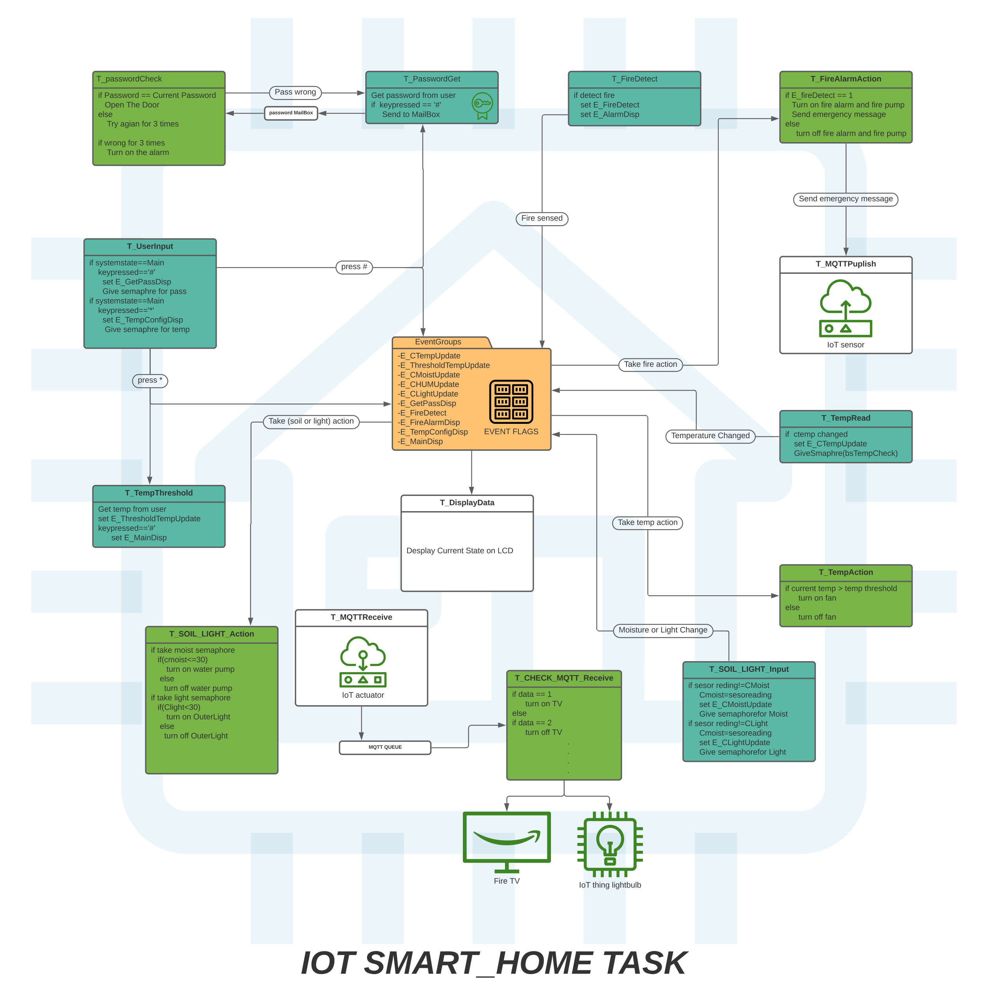
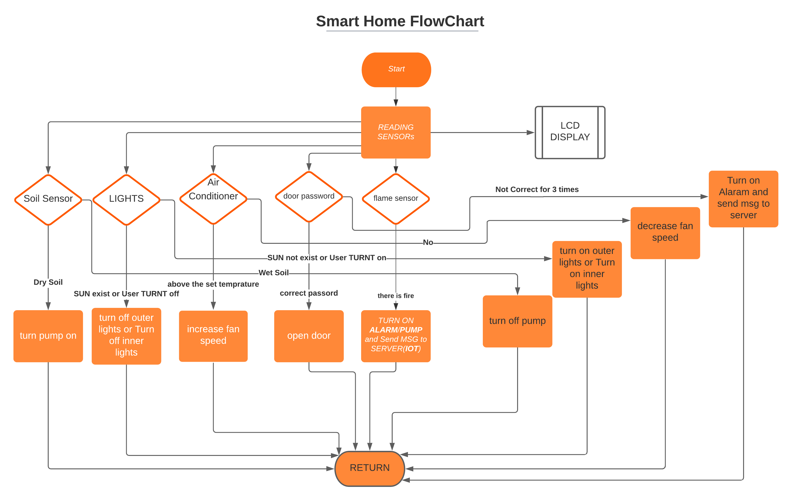
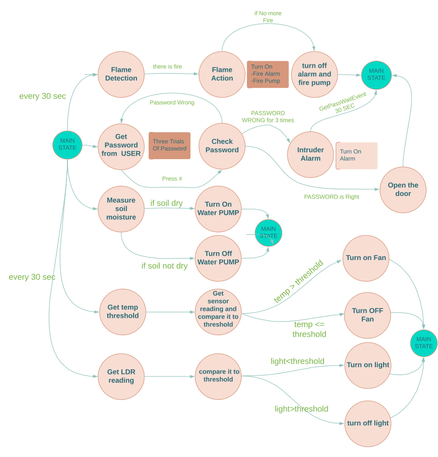
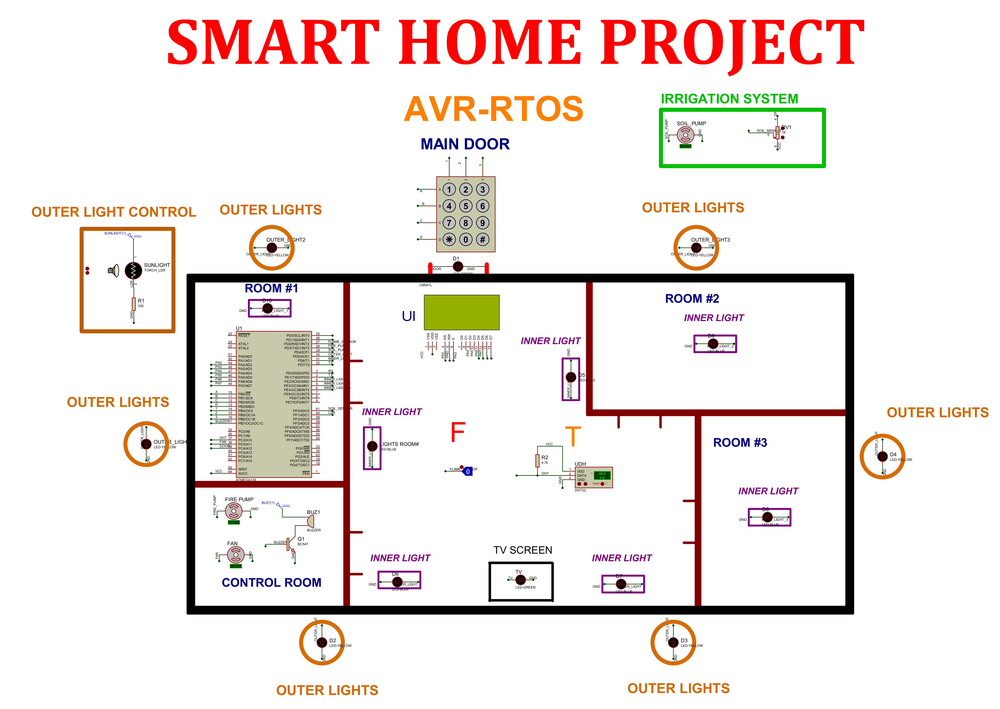

# 🏠 Integrated Smart Home & Security Ecosystem (NTI)

> A multi-module embedded system built on **ATMEGA128** using **FreeRTOS** for home automation, security, and IoT remote control — written in **C**.

---

## 📌 Overview

This project is a comprehensive smart home system designed to handle high I/O demands and complex peripheral interfacing using the **ATMEGA128 microcontroller**. It integrates five key modules running concurrently under **FreeRTOS**: security, fire safety, environmental automation, IoT remote control, and a real-time LCD interface — all working together in a single unified embedded system.

---

## 🏡 System Layout


The diagram illustrates the physical placement of all system components across the home:
- 🔐 Door lock & keypad — Main entrance
- 🔥 Flame sensor & buzzer — Indoor safety
- 🌡️ DHT22 sensor — Indoor temperature & humidity monitoring
- 💡 LDR sensor & outer lights — Outside
- 💧 Soil moisture sensor & water pump — Garden
- 📺 TV & inner lights — Living room (IoT controlled)
- ❄️ Fan/AC — Temperature-based automation

---

## ✨ Features

### 🔐 Security
- **Keypad-Authenticated Door Lock** — Password-protected entry system. Access is granted only upon correct PIN entry with LCD feedback.
- **Intruder Alarm** — If password is entered incorrectly 3 times, alarm activates and an emergency MQTT message is sent to the server.

### 🔥 Safety
- **Autonomous Fire Alarm System** — Flame sensor triggers buzzer and fire pump automatically, with real-time MQTT alert to mobile app.

### 🌿 Environmental Automation
- **Automatic Irrigation System** — Reads soil moisture via analog sensor and activates water pump when moisture falls below a user-configurable threshold (closed-loop control).
- **Adaptive LDR Lighting** — Reads ambient light level and automatically controls outer lights based on a user-configurable cutoff value.
- **Temperature Control** — DHT22 sensor reads indoor temperature; fan activates automatically when temperature exceeds a user-defined threshold.
- **Humidity Monitoring** — Indoor humidity is monitored and published in real time via MQTT.

### 📡 IoT Remote Control
- **MQTT Protocol** — All sensor readings are published in real time to a mobile app. Appliances (TV, inner light, fan, outer light) can be controlled remotely via MQTT commands.

### 🖥️ LCD Interface
- **4-Line Real-Time Display** — Shows live sensor readings (moisture, light, humidity, temperature) with a navigable menu for system configuration.

### ⚙️ User Configuration
Users can configure 3 system thresholds at runtime via keypad:
- 🌡️ Temperature threshold for fan activation
- 💡 LDR cutoff value for outer lights
- 💧 Soil moisture threshold for irrigation

---

## 🛠️ Tech Stack

| Component         | Details                                                        |
|-------------------|----------------------------------------------------------------|
| Microcontroller   | ATMEGA128                                                      |
| Language          | C                                                              |
| RTOS              | FreeRTOS                                                       |
| Protocol          | MQTT (IoT Communication via UART)                              |
| Sensors           | DHT22 (Temp/Humidity), Soil Moisture, LDR, Flame              |
| Input             | Matrix Keypad                                                  |
| Output            | Door LED, Water Pump, Fire Pump, Fan, Buzzer, Outer Lights, Inner Light (LED), TV (LED) |
| Display           | 4x16 LCD                                                       |
| Communication     | UART                                                           |
| Simulation        | Proteus Design Suite                                           |
| Serial Emulation  | VSPE (Virtual Serial Port Emulator)                            |

---

## 🗂️ Hardware Architecture



---

## ⚙️ FreeRTOS Tasks

| Task | Priority | Description |
|---|---|---|
| `T_FireDetect` | 9 | Polls flame sensor every 500ms |
| `T_FireAlarmAction` | 10 | Activates buzzer + pump on fire detection + MQTT alert |
| `T_TempRead` | 7 | Reads DHT22 sensor every 10s |
| `T_TempAction` | 8 | Controls fan based on user-defined temperature threshold |
| `T_PasswordGet` | 5 | Reads keypad password input |
| `T_PasswordCheck` | 6 | Validates password → opens door or triggers intruder alarm |
| `T_UserInput` | 4 | Handles LCD menu navigation |
| `T_SOIL_Input` | 2 | Reads soil moisture sensor every 10s |
| `T_SOIL_Action` | 3 | Controls water pump based on moisture threshold |
| `T_LIGHT_Input` | 2 | Reads LDR sensor every 1s |
| `T_LIGHT_Action` | 3 | Controls outer lights based on LDR threshold |
| `T_DisplayData` | 1 | Updates LCD with live sensor readings |
| `T_SystemModify` | 5 | Handles user configuration (temp/moisture/light thresholds) |
| `IOTcharinput` | 2 | Controls appliances via MQTT commands |

### RTOS Primitives Used
- **Event Groups** — inter-task signaling (sensor updates, UI states, alarms)
- **Binary Semaphores** — password entry synchronization
- **Queue** — passing password data between tasks



---

## 📡 MQTT Topics

| Topic | Direction | Description |
|---|---|---|
| `G/temp` | Publish | Current temperature + fan status |
| `G/hum` | Publish | Current humidity |
| `G/soil` | Publish | Soil moisture level + pump status |
| `G/light` | Publish | Light level + outer light status |
| `G/fire` | Publish | Fire alarm status |
| `G/devices` | Subscribe | Remote control commands for appliances |

### Remote Control Commands (via `G/devices`)

| Command | Action |
|---|---|
| `'1'` | TV ON |
| `'0'` | TV OFF |
| `'2'` | Inner Light ON |
| `'3'` | Inner Light OFF |
| `'4'` | Fan ON |
| `'5'` | Fan OFF |
| `'6'` | Outer Light ON |
| `'7'` | Outer Light OFF |

---

## 🔄 System Flowchart



---

## 🔀 State Machine



---

## 📁 Project Structure

```
SmartHome-RTOS/
├── SmartHome_RTOS V2/            # Main project (latest version)
│   ├── APP/
│   │   └── main.c
│   ├── HAL/                      # Hardware Abstraction Layer
│   │   ├── inc/
│   │   │   ├── DHT.h
│   │   │   ├── KEYPAD.h
│   │   │   └── LCD.h
│   │   └── src/
│   │       ├── DHT.c
│   │       ├── KEYPAD.c
│   │       └── LCD.c
│   ├── MCAL/                     # Microcontroller Abstraction Layer
│   │   ├── inc/
│   │   │   ├── ADC.h
│   │   │   ├── DIO.h
│   │   │   ├── registers.h
│   │   │   └── uart128.h
│   │   └── src/
│   │       ├── ADC.c
│   │       ├── DIO.c
│   │       └── UART128.c
│   ├── RTOS/                     # FreeRTOS Kernel
│   ├── Services/
│   │   └── MQTT/
│   │       ├── MQTT.c
│   │       └── MQTT.h
│   ├── Smart Home/
│   │   ├── inc/
│   │   │   ├── Proj_Cof.h
│   │   │   └── SmartHome.h
│   │   └── src/
│   │       └── SmartHome.c       # All FreeRTOS tasks
│   └── Utility/
│       ├── bitMath.h
│       └── dataTypes.h
├── SIM_v3/                       # Proteus Simulation (latest)
│   ├── IOT_SmartHome_RTOS.pdsprj # Proteus project file
│   ├── SmartHome_RTOS.hex        # Compiled HEX for direct simulation
│   └── simulation_preview.png    # Simulation screenshot
├── Documents/
│   ├── charts/
│   │   └── System_Flowchart.png
│   └── design/
│       ├── Hardware_Design_Diagram.png
│       ├── Home_Layout.png
│       ├── State_Machine.png
│       └── Task_Interaction_Diagram.png
├── VSPE config/                  # Virtual Serial Port config
└── archive/                      # Old versions
    ├── SmartHome_RTOS/
    ├── SIM/
    ├── SIM_v1/
    └── SIM_v2/
```

---

## 🖥️ Simulation



> 🎬 Full demo GIF coming soon!

Proteus simulation files and HEX file are available in `/SIM_v3/`.
Open with **Proteus Design Suite** (version 8 or later recommended).

For UART/MQTT testing, use **VSPE (Virtual Serial Port Emulator)** with the config file in `/VSPE config/`.

### ⚠️ Simulation Notes
- **Flame Sensor** → Represented by a logic toggle switch. Click during simulation to trigger fire alarm.
- **Soil Moisture Sensor** → Represented by a variable resistor. Adjust value to simulate dry/wet soil conditions.

---

## 🚀 Getting Started

### Prerequisites
- AVR-GCC Compiler
- AVRDUDE (for flashing)
- ATMEGA128 Development Board
- MQTT Broker (e.g., Mosquitto)
- Proteus Design Suite (for simulation)
- VSPE (for serial emulation)

### Build & Flash

```bash
# Compile
avr-gcc -mmcu=atmega128 -Os -o main.elf main.c

# Convert to hex
avr-objcopy -O ihex main.elf main.hex

# Flash to microcontroller
avrdude -c usbasp -p m128 -U flash:w:main.hex
```

---

## 🎓 Project Context

This project was developed as part of the **NTI (National Telecommunication Institute)** training program, demonstrating practical skills in:
- Embedded C programming
- FreeRTOS multitasking (tasks, semaphores, queues, event groups)
- Peripheral interfacing (UART, ADC, GPIO)
- Real-time sensor-based closed-loop control
- IoT communication via MQTT protocol
- Layered software architecture (MCAL / HAL / APP)

---

## 📄 License

This project was developed during **NTI (National Telecommunication Institute)** training. All rights reserved.

---

## 🙋‍♂️ Author

**Mohamed Ramadan**
Embedded Systems Engineer
[LinkedIn](https://linkedin.com/in/muhamed-ramadan) • [GitHub](https://github.com/Muhamed-Ramadan)
